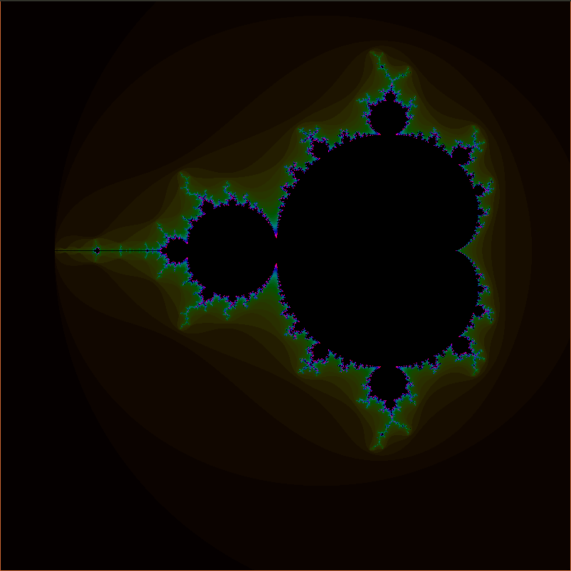
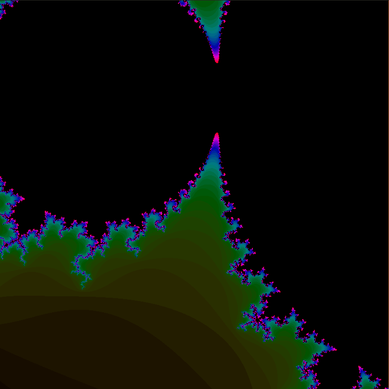
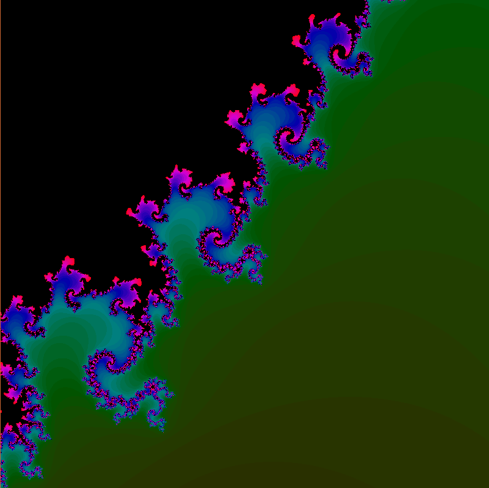
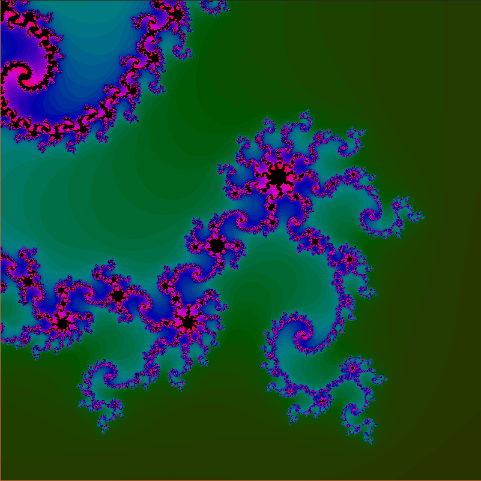
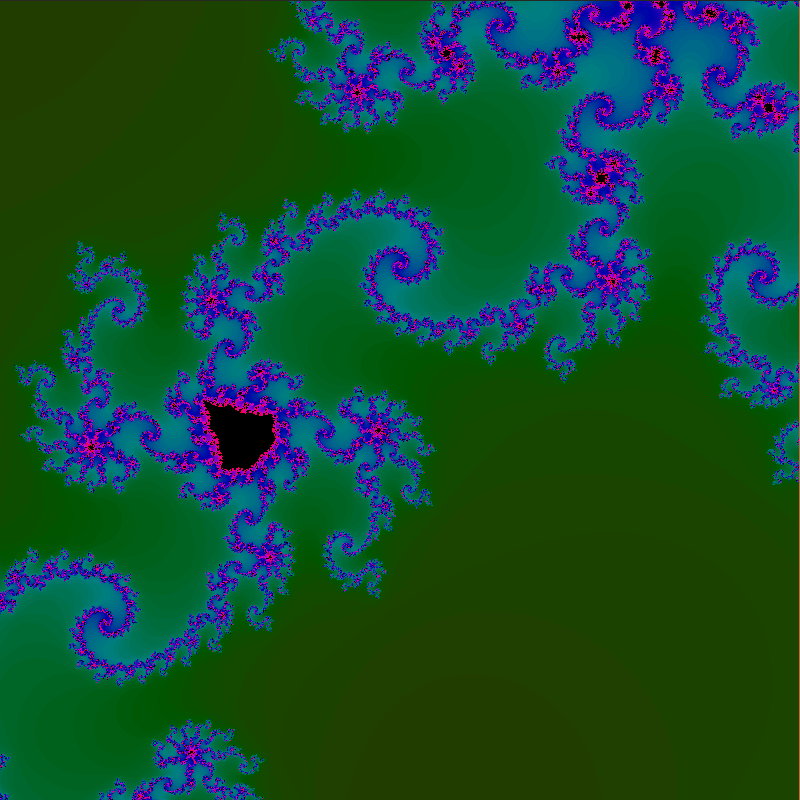
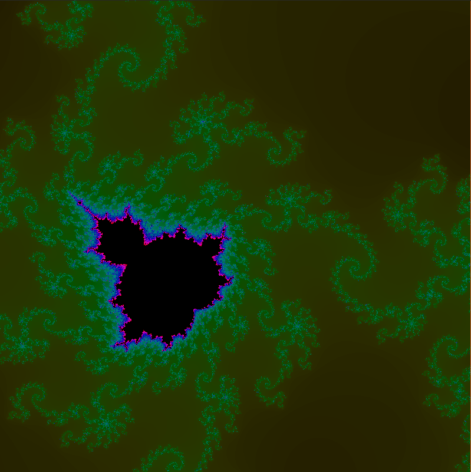
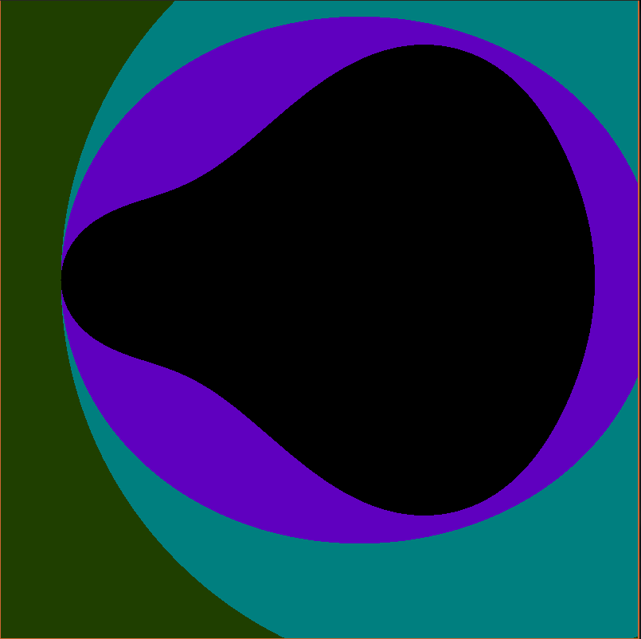

# Mandelbrust









This project draw a mandelbrot fractale.

It use the `minifb` crate for the window / drawing.

To build the project use:
```
cargo build --release
```

To run the project:
```
cargo run --release
```

## Control

- Use the arrow key to move on the fractal.
- Use `zqsd` to move
- Use `wasd` to move
- `i`: Augment the level of iteration
- `u`: Reduce the level of iteration
- `space`: Zoom in the fractal
- `x`: Unzoom the fractal
- `escape`: Exit
